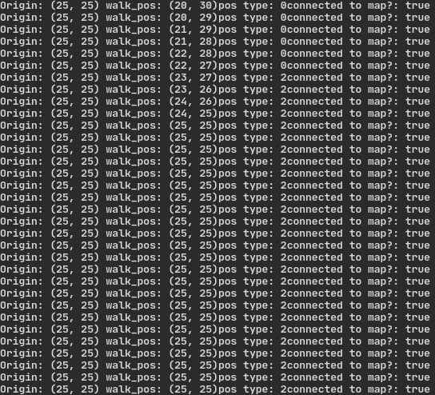

# Agenda
---
Main Goal: Only implement things we have already done, Jackson "The Goat" Mclane.
- Fixes
	- Make sure that we are not returning false positives for the border tile check
	- Fix the issue that when the structure is identifying if it is connected to the map, its check of the surrounding tiles throws an error because it checks a side that is inside to the edge offset 
	- Weird bug I fixed:
		- 
		- 
		- Structure would path to the center and get stuck inside a structure. I now have the path end if it reaches the center
		- 
- Place wall tiles
	- iterate through null tiles or floor and structure tiles, if it is neighboring a structure or a floor tile, place the correct wall
	- Not sure how this will be handled when we don't keep a data structure of tiles
	- Eventually, we could store them during creation in a dictionary
	- `Dictionary[tile_type: int, tiles: Array[Tile]`
		- `FLOOR: [Tile{position},...]`
		- `...`
- Attach collision on wall
- Start on player